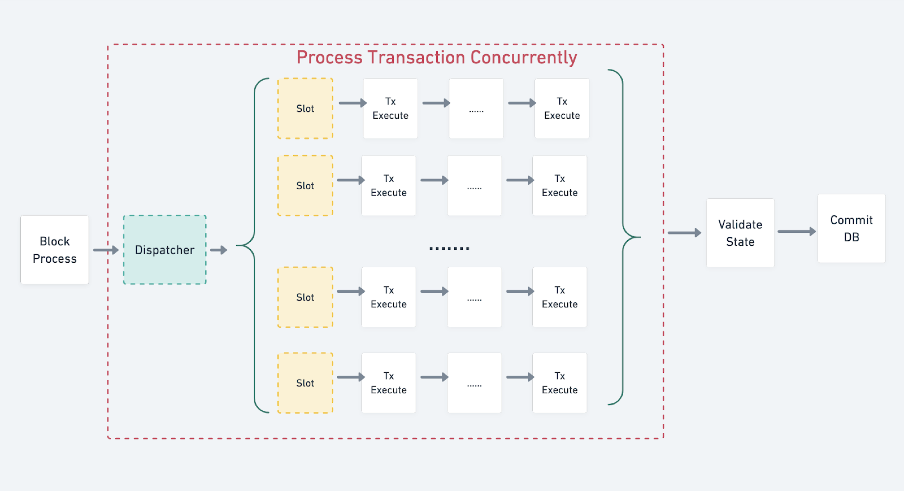
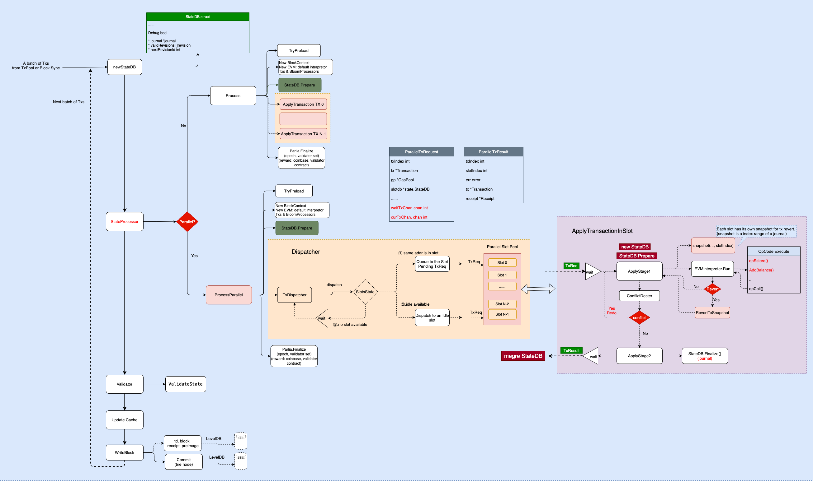
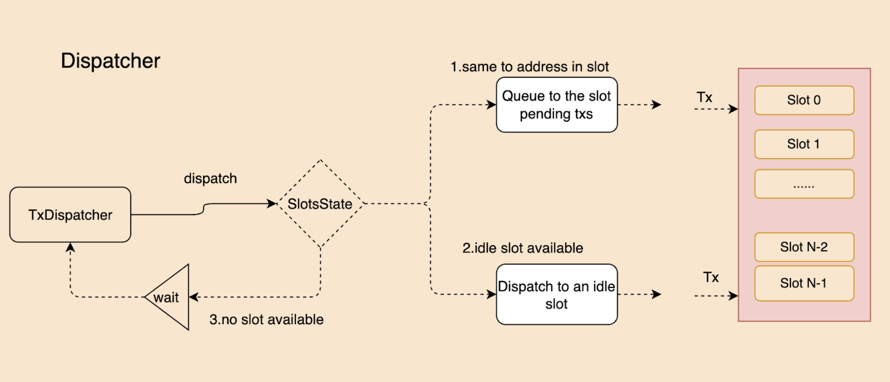
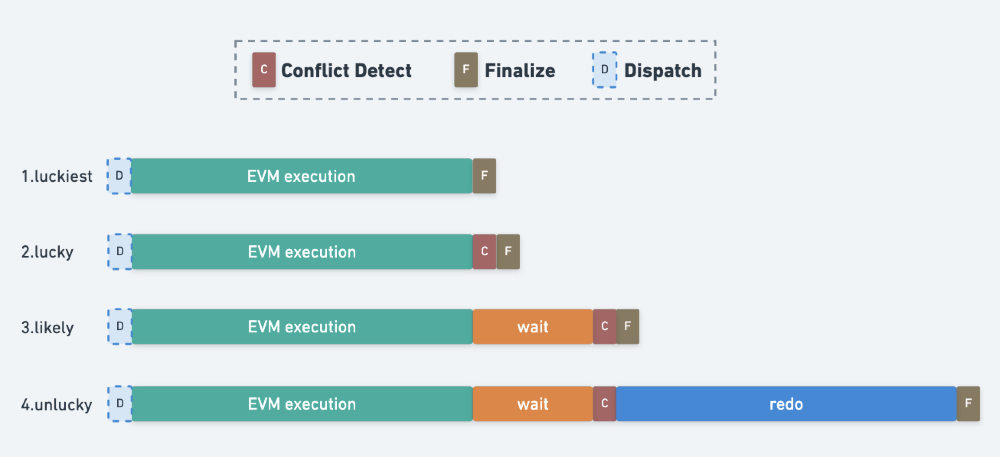
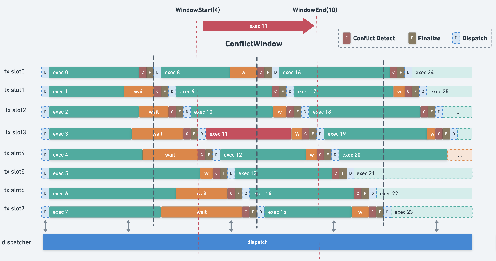

# BEP-130: Parallel Transaction Execution

## 1. Summary

This BEP introduces a parallel transaction execution mechanism on the Binance Smart Chain.

## 2. Abstract

To improve the performance of block execution, this BEP introduces a mechanism to execute the transactions within one block concurrently to some extent.

In the stage of block execution, this BEP introduces two new components:

1. Dispatcher
2. Slot

The slot is where the transactions are executed and the transactions in different slots can be executed concurrently.

The dispatcher will dispatch the transactions in a block to the slots sequentially according to the dispatching strategy.

Since the transactions can be executed in different slots concurrently, the performance of the block execution should be improved if there are not many conflicts between the different slots.

## 3. Status

This BEP is a draft.

## 4. Motivation

BSC is facing the challenge of huge traffic and the daily transaction volume had reached an all-time high of 16 million recently. The network always might get congested when there is a promotion activity happening on a popular dApp.

Besides validators, full nodes also experienced difficulty to catch up the new blocks due to the heavy computing and storage load.

The execution of the block transactions takes up most of the time when producing or synchronizing(in full sync mode) the blocks. For now, the transactions are executed sequentially. Introducing a parallel EVM execution mechanism can utilize the performance of multi-core processors and reduce the time of block execution which will improve the capacity of the whole network.

## 5. Design Principle

There are some principles that we will stick to when we design the parallel execution proposal.

### Compatiable

It should not change the workflow of current BSC’s working process, e.g., consensus algorithm, storage format, contract opcode format, all of these component’s behavior should stay unchanged.

In short, the parallel execution will produce the same result as the current sequential execution.

### None Intrusion & Decoupled

The implementation should be kept within the execution layer, it should not change the data structure or interface of other modules.

And also, it should be decoupled. There are modules such as BlockProcessor, EVM Interpreter, StateDB, StateObject, ReceiptProcessor… within the execution layer. Parallel execution could introduce new modules, such as TxDispatcher, TxResultMerger, ConflictDetector, SlotState… they should be decoupled, no circular dependency.

### Configurable

The BSC node could configure its parallel execution parameters based on its hardware resources, since different hardware could have different best practice parameters.

The parameters that can be configured could be: enable/disable, concurrent number, MaxQueueSize for each slot, dispatcher policy etc.

These parameters can be configured on node startup or even at runtime.

### Keep It Simple And Smart

The parallel execution could be very complicated, especially its execution pipeline, unorder execution & inorder commit, thread safe stateobject access, conflict detect algorithm…

But design should keep it as simple as possible, complexity makes product unstable.

And to achieve the best performance benefits, it should be smart on how to dispatch transactions to reduce transaction conflict and make the parallel execution slots workload balance.

## 5. Specification

### 5.1 Overview

The goal of this BEP is to improve the performance of block execution by executing the transactions concurrently to a certain extent.

Two major components will be introduced in block execution:

1. Dispatcher.
2. Slot.

A configured number of slots will be created on BSC node startup, which will receive transaction requests from the dispatcher and execute transactions concurrently. Transactions that are dispatched to a same slot will be executed sequentially in this slot.

The dispatcher will dispatch the transactions in a block to slots sequentially when there is a slot available.

#### 5.1.1 Workflow

Here is the general workflow of the parallel execution. When a batch of transactions are received, no matter from P2P transaction pool or downloaded blocks, there will be a state processor to handle the transactions. If parallel is not enabled, the transactions will be processed sequentially as before, otherwise they will be handled by the parallel processor, the details will be explained later.

#### 5.1.2 Pipeline

The parallel transaction execution would have a pipeline. The current design is for the initial phase, and it will be optimized to get the best performance.

Let’s have an overview of the parallel pipeline first, with 8 concurrencies as an example.

### 5.2 Initialize

The parallel initialization will be done on node startup, if parallel execution is enabled. The parallel slot pool will be created, each slot will have a SlotState structure to maintain its state. Then the slot will be waiting until it receives a new transaction execution request.

### 5.2 Dispatcher

The dispatcher is responsible for dispatching the transactions in the block to the slots sequentially.

The dispatcher will select a suitable target slot for each transaction and dispatch it to that slot, transactions in a block will be dispatched sequentially. The target slot for a transaction is decided at runtime, based on the state of parallel execution pipeline.

There are many factors that will be taken into consideration to make the decision:

1. Is the slot idle or occupied?
2. If there is a same address contract running or pending in this slot?
3. Has the slot’s pending transactions size reached the max transactions queue size limitation already?
4. If there is a very big transaction index gap between the slot’s head transactions and the transactions to be dispatched?
5. If the transaction address is a known contract with high conflict rate according to history data.
6. If the transaction address is a known contract with a huge gas cost?

…

The dispatcher will try to make the best decision and select an available slot for the transaction, the dispatch algorithm’s target to make a balanced workload and with less state conflict.

### 5.3 Slot Execution

The slot is where transactions are executed. Transactions will be dispatched to slots sequentially by the dispatcher and executed sequentially in the same slot. Transactions dispatched to different slots can be executed concurrently.

There is a pending transaction queue in the slot. When the slot is occupied, the dispatcher can still dispatch transactions to the pending queue of the slot.

#### 5.3.1 State Of Slot

There are two states of a slot:

1. Idle. The slot will be marked idle when there is no transaction executing or no pending transaction in the slot.
2. Occupied. The slot will be marked occupied if it’s executing a transaction and there may be even pending transactions.

#### 5.3.2 Execution Stages In Slot

Since transactions are executed concurrently in different slots, the state read by a slot could be changed by other slots, making the transaction's execution result invalid. The invalid transaction should be executed again based on the latest state.

For clarity, five stages will be introduced in the transaction execution:

1. EVM execution. Execute the transaction based on a specific worldstate.
2. Wait for the finalization of the previous transactions in the block.
3. Conflict detection. Detects if there is any conflict between the storage read by this transaction and the storage changed by concurrent transactions in other slots within a conflict detect window.
4. Redo transaction. If there is any conflict detected, the current transaction should be executed again based on the latest finalized worldstate.
5. Finalize. Finalize the state changed by the current transaction to the latest world state.

Not every transaction will go through these five stages.

1. If the transaction is the first transaction of a block, it is the luckiest, no need to wait or do conflict detection, it can be finalized right after execution.
2. If its previous transaction was completed in the same slot, it is lucky, no need to wait too, do conflict detect and finalize.
3. For the majority of transactions, they likely need to wait for the previous transactions(TxIndex-1) to complete before it can do conflict detection.
4. And for unlucky transactions, they waited and conflict detected, they need to be redo based on the latest world state. Since redo is based on the latest world state, it won’t conflict and can skip the conflict detection stage.

#### 5.3.3 Conflict Detection

After a transaction is executed in a slot, it needs to make sure the previous transaction is finalized, so that it can check if there is any state conflict, otherwise its execution result can not be confirmed.

The previous transaction can be in the same slot or different slot, each slot will provide a waiting channel for the transaction, so the previous transaction can notify it when finalized.

The transaction execution is marked as conflict, only if the information it got was changed by other transactions since the current transaction execution was started. To make it more clear, overlapped read without write won’t be marked as conflict, hardcode write without read won’t be marked as conflict as well.

##### Conflict Detection Items

* StorageObject’s key/value pair
* Account Balance
* Contract Code/CodeHash/CodeSize…
* Contract State: created and suicided

##### Conflict Window

The transaction is executed based on a specific world state, when transaction execution is done, the world state could have been updated several times(each transaction will update world state once).

Conflict window is an important structure to represent the transaction range that the current transaction needs to compare with. All of the world state changes within this window will be used to compare with the current transaction’s access list, to check if any read information has been updated and not valid anymore.

#### 5.3.4 Transaction Redo

If a conflict is detected, the conflicted execution result is not reliable and will be discarded. And the transaction needs to be redo based on the latest world state. The transaction redo will not have conflicts, since all of the previous transactions have been finalized now, it can get the fresh world state and all the state objects will be valid.

#### 5.3.5 Transaction Result Merge

The state changes of the transaction are kept within the execution slot. They need to be merged to the main StateDB once the transaction execution is done and the result is valid.

### 5.4 Handle System Contract

System contracts are built in contracts to perform system level operations, such as gas fee reward, cross chain communication etc. These contracts are important components of the chain and their behavior may depend on the execution results of other transactions, so they can not be executed concurrently. Parallel transaction execution will not be applied to these system contracts, they will be executed sequentially as before.

Since most of the transactions in a block are not system contracts, parallel execution still can work for most of the transactions.

### 5.5 Block Mining and Sync

There are two different phases of transaction execution: block mining and block sync.

For the mining phase, the block is under mining and the transactions to be executed are gathered from the P2P transactions pool. There would be invalid transactions, because of bad nonce, block gas limit reached etc. These invalid transactions will not be put into the block. The concurrently executed transaction would have no idea what its transactions index in the block is or which transaction is the previous transaction until the block is mined.

For the sync phase, the block is supposed to be confirmed, the transactions in the block are determined.

Parallel transaction execution will support both of the two phases, but there could be some differences for implementation.