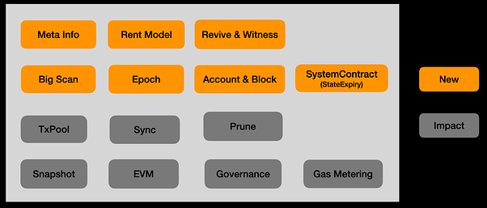
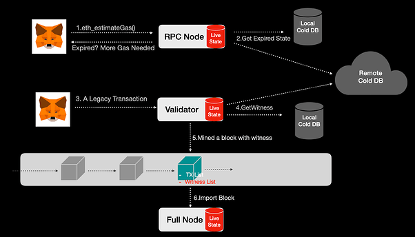
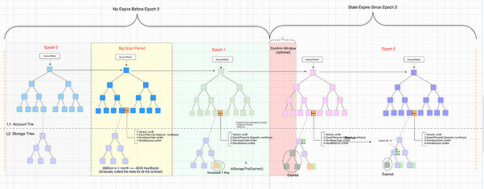
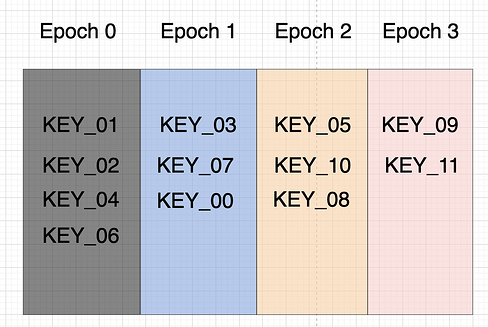
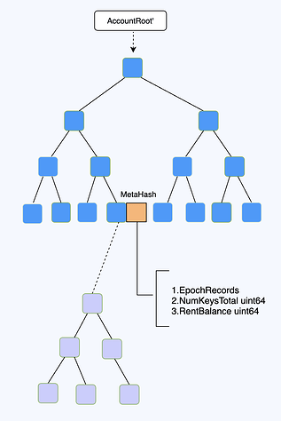
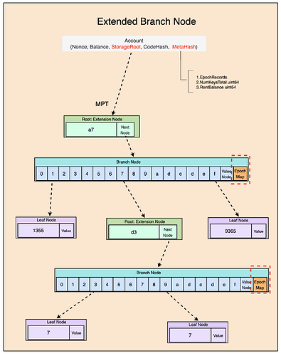
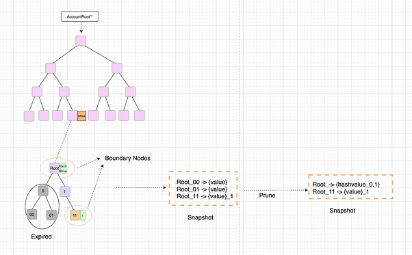

<pre>
  BEP: 206
  Title: Hybrid Mode State Expiry
  Status: Stagnant
  Type: Standards
  Created: 2023-02-24
  Discussions: https://forum.bnbchain.org/t/bep-idea-state-expiry-on-bnb-chain/646/10
</pre>

# BEP: Hybrid Mode State Expiry
- [BEP: Hybrid Mode State Expiry](#bep-hybrid-mode-state-expiry)
  - [1.Summary](#1summary)
  - [2.Motivation](#2motivation)
  - [3.Specification](#3specification)
    - [3.1.Design Guide](#31design-guide)
      - [a.The Two Principles](#athe-two-principles)
      - [b.Better To Have](#bbetter-to-have)
    - [3.2.The Components](#32the-components)
      - [a.New Components](#anew-components)
      - [b.Existing Components](#bexisting-components)
    - [3.3.General Workflow](#33general-workflow)
      - [a.From User’s Perspective](#afrom-users-perspective)
      - [b.From Node’s Perspective](#bfrom-nodes-perspective)
        - [In Epoch 0](#in-epoch-0)
        - [In Epoch 1](#in-epoch-1)
        - [In Epoch 2+](#in-epoch-2)
    - [3.4.The Meta](#34the-meta)
      - [a.Definition](#adefinition)
      - [b.How to persistent the meta bytes](#bhow-to-persistent-the-meta-bytes)
      - [c.How To Update The MetaInfo](#chow-to-update-the-metainfo)
      - [d.How To Calculate The MetaHash](#dhow-to-calculate-the-metahash)
    - [3.5.Epoch Information In Trie Node](#35epoch-information-in-trie-node)
    - [3.6.About GetState/SetState](#36about-getstatesetstate)
    - [3.7.Gas Metering](#37gas-metering)
    - [3.8.Support Snapshot](#38support-snapshot)
      - [a.By Off-Line Prune](#aby-off-line-prune)
      - [b.Handle State Revive](#bhandle-state-revive)
      - [c.Handle New Key Insert](#chandle-new-key-insert)
    - [3.8.The Rent Model](#38the-rent-model)
      - [a.Rent Policy](#arent-policy)
      - [b.How To Fill The RentBalance](#bhow-to-fill-the-rentbalance)
      - [c.How To Determine The RentPrice](#chow-to-determine-the-rentprice)
      - [d.How To Charge Rent Fee](#dhow-to-charge-rent-fee)
    - [3.9.Precompile Contracts: BSCStateExpiry](#39precompile-contracts-bscstateexpiry)
    - [3.10.New Account Structure](#310new-account-structure)
    - [3.12.New Block Structure (TBD)](#312new-block-structure-tbd)
    - [3.12.State Revive](#312state-revive)
    - [3.13.Prune (Important)](#313prune-important)
    - [3.14.Remote DB](#314remote-db)
    - [3.15.New RPC](#315new-rpc)
  - [4.Rationale](#4rationale)
    - [4.1.Why Keep The L1 Account Trie](#41why-keep-the-l1-account-trie)
    - [4.2.Why Not Create A New L2 Storage Trie](#42why-not-create-a-new-l2-storage-trie)
    - [4.3.Reasonable Epoch Period](#43reasonable-epoch-period)
    - [4.4.Why Rent Model](#44why-rent-model)
  - [5.Forward Compatibility](#5forward-compatibility)
    - [5.1.Account Abstraction](#51account-abstraction)
    - [5.2.L2 Rollup: Optimism \& ZK](#52l2-rollup-optimism--zk)
    - [5.3.VerkleTree \& Stateless](#53verkletree--stateless)
    - [5.4.PBSS](#54pbss)
  - [6.Backward Compatibility](#6backward-compatibility)
    - [6.1.Transaction Execution](#61transaction-execution)
    - [6.2.User Experience](#62user-experience)
    - [6.3.Web3 API](#63web3-api)
    - [6.4.Snap Sync](#64snap-sync)
    - [6.5.Archive Node](#65archive-node)
    - [6.6.Light Client](#66light-client)
  - [7. License](#7-license)


## 1.Summary
This BEP proposes a practical solution to address the problem of increasing world state storage on the BNB Smart Chain, by removing expired storage state.

## 2.Motivation
Storage presents a significant challenge for many blockchains, as new blocks are continually generated, and transactions within these blocks could invoke smart contracts that also add more states to the blockchain.
A large storage size can cause several side effects on the chain, such as higher hardware requirements, increased network resources required for downloading and performing p2p sync, and performance degradation due to MPT write amplification.

Due to the high volume of traffic, the storage size on BSC grows very rapidly. As of the end of 2022, a pruned BSC full node snapshot file is approximately 1.6TB in size, compared to approximately 1TB just one year ago.
The 1.6TB storage consists mainly of two parts:
- Block Data (~2/3), which includes the block header, block body, and receipt;
- World State (~1/3), which includes the account state and Key/Value (KV) storage state.
The Ethereum community proposed [EIP-4444](https://eips.ethereum.org/EIPS/eip-4444) to address the first part, which is to prune old block data. However, EIP-4444 does not address the second part, which is more challenging.
There have been many discussions on how to implement state expiry, with one proposed solution involving the removal of EOA accounts, extension of the address space, and the use of Verkle Trees to reduce the witness size. However, implementing such a solution would be a significant undertaking that could have a substantial impact on the ecosystem, and may not be feasible in the short term. As BSC continues to face high traffic volumes, it is essential to develop a short-term solution for state expiry that can be implemented quickly, while still retaining the ability to upgrade to a long-term solution once it becomes available.

## 3.Specification

|Variable|Description|
| --- | --- |
|Epoch|A time span defined by block number, if set it to ~⅔ year, if BSC validators produce block every 3 second, it would be (365\*2/3)*24\*60\*60/3 = 7,008,000|
|NumKeysLastEpoch|Number of keys that are accessed during last epoch|
|NumKeysLive|Number of keys that are not expired, i.e. accessible|
|NumKeysTotal|Total number of keys, both expired and not expired|
|HotContractThreshold|The threshold to determine if the contract is hot or not, hot means a certain percentage of live states were accessed during the last epoch. If the majority of the state were accessed recently, then the state of the contract will not expire.|
|WitnessPrice|The gas price of 1 byte witness, as witness will be part of the block and needs extra effort for validator to collect it, it could be more expensive than gas price of calldata.|

### 3.1.Design Guide

#### a.The Two Principles

* Rule 1: Permanent delete is unacceptable, expired state must be able to be revived.
* Rule 2: Contract’s execution logic should stay unchanged, if it fails to get the correct state, the execution result will be discarded, i.e. transaction will be reverted.

#### b.Better To Have

* Simple protocol

* Less impact to UX
* Affordable price: storage access fee, state revive fee…

### 3.2.The Components

There will be some new components introduced and some existing components will be updated.


#### a.New Components

* Meta Info: it is used to record the contract’s storage status.
* Rent Model: if a user wants to keep their state from being expired, they will need to pay for the storage rent fee. The rent model will define the detailed rules of how rent fees will be charged.
* Revive & Witness: it will define the procedure for user to revive their expired state. And witness will define the format of witness to revive state, to make it more compact, witness could be merged to remove duplicated bytes.
* Account & Block: the structure of Account and Block is quite important, they will be upgraded to support state expiry.
* Big Scan: it is a special phase to collect the storage information of each contract by scanning all the contract accounts. It could take several weeks, depending on the capability of the nodes.
* Epoch: it represents a certain time span, state expiry will be Epoch based, one Epoch could be around ⅔ year.
* SystemContract(StateExpiry): a new system contract would be created to manage the state expiry policies.

#### b.Existing Components

* TxPool: transactions with expired state accessed need to be treated specially, tx pool module may need to be upgraded to make it more efficient.
* Sync: will be upgraded to support sync of witness and metainfo.
* Prune: it will be upgraded to support prune expire state, beside MPT trie node, it also needs to prune the storage of snapshot.
* Snapshot: snapshot will be upgraded to record the status of each KV
* Governance: some of the arguments need to be adjusted dynamically, e.g. the ScanSpeed, RentPrice, ContractLivenessThreshold…
* Gas Metering: will be upgraded to support witness charge.

### 3.3.General Workflow

#### a.From User’s Perspective

Users will not need to be aware of StateExpiry, generally before users send out the transaction, they would query a RPC node about the estimated gas needed. The RPC nodes will estimate the gas needed based on execution fee and the fee to revive all the expired states. If the estimated gas needed is acceptable, the user will send out the transaction as usual.

When the transaction is propagated to the tx pool of validator, the validator would know whether the transaction needs to access any expired state or not, if yes, the validator would be required to collect the witness and rewarded accordingly. It is ok if the validator does not get the witness, then the validator will not be allowed to include this transaction.



#### b.From Node’s Perspective


##### In Epoch 0

Nothing will be changed, nodes just operate as usual.

##### In Epoch 1

State will not expire when entering Epoch 1, so the whole state will be there in Epoch 1, no rent will be charged either. But the meta information will be updated on block finalization to record the latest status.

##### In Epoch 2+

Since Epoch 2, state expiry will start to work. The state of the contract will be expired if none of the following requirements are met:

* The state has been accessed in current or last epoch.
* It is hot, i.e. the percentage of keys accessed during the last epoch is greater than or equal to $LivenessThreshold (unable to do it without big scan, )
* It has enough RentBalance left for KV pairs in old epochs, KV in current and previous epoch will be exempted. (not determine, if rent model will be used)

### 3.4.The Meta

#### a.Definition
```
Version uint8 // in case meta definition upgrade in the future?
RLP {
  EpochRecords []{epoch, numKeys} // for epoch based rent charge
  NumKeysTotal uint64 // without keys in epoch0 if no big scan
  RentBalance uint64 // deduct on access
}
```
// if no rent, no meta content needed, can be empty



#### b.How to persistent the meta bytes
There will be a meta hash in account structure, which will be the key to access encoded meta information.



#### c.How To Update The MetaInfo

It will be updated on block finalization, not by transaction level. When a block is finalized, then the access record will be determined, we will know the keys that are accessed, created or deleted. These information will be updated to the meta structure

#### d.How To Calculate The MetaHash

Metahash is just simply the keccak256 hash of the meta bytecode

### 3.5.Epoch Information In Trie Node

It would be very simple, only extend the current branch node, which will include an epoch map, which is used to mark its children’s accessed epoch value. Hash calculation will include this epoch map element, so once the epoch map is updated, the corresponding intermediate nodes will be updated as well.



### 3.6.About GetState/SetState

If GetState tries to access an expired state, then the transaction will be reverted.

For SetState, it must do GetState first, if GetState fails due to accessing expired state, then the transaction will be reverted.

And since delete operation can be treated the same as set, it also needs to perform GetState first.

### 3.7.Gas Metering

Depends on the witness size used in this contract, the cost can calculated simply by: WitnessSize * WitnessPrice

If several transactions have overlapped KVs to revive, the first transaction would probably pay more, as when the later transaction to access these KVs, they are already revived.

It is somehow reasonable, as the first transaction will be executed first, so it will pay slightly more.

### 3.8.Support Snapshot

Snapshot will still be corresponding to the MPT structure.

Once the MPT is shrinked due to more sub-paths being expired, which will make the MPT end up with some boundary nodes. Boundary nodes are trie nodes that are either leaf nodes or intermediate nodes with at least one of its children expired.

The snapshot shrink can be conducted by off-line prune according to the MPT.


#### a.By Off-Line Prune

After off line prune of the MPT trie, the boundary will be generated. Then just go through the MPT tree, prune the snapshot according to the intermediate boundary node.
```
// For contratc A, it has several several hashed keys with epoch marked:
0x000000000000000000000000_00000000, epoch 1
0x000000000000000000000000_01000000, epoch 0
0x000000000000000000000000_01010000, epoch 0
0x000000000000000000000000_01020000, epoch 0
0x000000000000000000000000_01030000, epoch 0
0x000000000000000000000000_02000000, epoch 1
0x000000000000000000000000_03000000, epoch 1

// Currently, it is in epoch 2, so after prune, the tree will be
0x000000000000000000000000_00000000, epoch 1
0x000000000000000000000000_01, epochMap(0,0,0,0) // 4 children expired in epoch 0
0x000000000000000000000000_02000000, epoch 1
0x000000000000000000000000_03000000, epoch 1
```
#### b.Handle State Revive
TBD

#### c.Handle New Key Insert
TBD

### 3.8.The Rent Model

#### a.Rent Policy

* KVs accessed in current or previous epoch will not be kept, no extra fee needed
* Liveness:

If the percentage of not expired KV accessed in the last epoch is greater than a threshold(30%? governable), then these alive KVs will not be expired.

update: no liveness check, since no big scan

* The Rent Balance will be used to pay for these alive KVs, pay by best

User could save a certain range of Epoch, user may prefer to only save the KV of a few recent epochs

#### b.How To Fill The RentBalance

There will be a system contract to handle it, users just need to call it with the target address & balance provided, the system contract will help add the rent balance to the target address.

The balance can not be reclaimed.

But if the user sends the balance to an un-existed address, can it be refunded?
```
// StateExpiryContract: 0x0000000000000000000000000000000000001008
// or Precompile Contract?
func AddRentBlance(target Address) {
  balance = GetValue() // value in transaction
  metaInfo = GetMetaInfo(target)
  metaInfo.rentBalance += balance
}
```
#### c.How To Determine The RentPrice

TBD

#### d.How To Charge Rent Fee

On first access of metainfo in a new Epoch, i.e. CurrentEpoch is not in EpochRecord, there will be a rent price for each epoch
```
EpochRecords []{epoch, numKeys} // for epoch based rent charge

if curEpoch in EpochRecords {
  // rent fee already charged, once per epoch
  return
}

// first time to access
var NewEpochRecords := {curEpoch, 0} // reset
EpochRecordsSorted := sort(EpochRecords) // decending order
for epoch, numKeys := range EpochRecordsSorted {
  fee := GetEpochFee(epoch, numKeys)
  if RentBalance >= fee {
    NewEpochRecords := append({epoch, numKeys})
    RentBalance -= fee
  }
}
```
### 3.9.Precompile Contracts: BSCStateExpiry

This contract will has some variable to set for governance
```
contract BSCStateExpiry {
  uint256 public scanSpeed;
  mapping(uint256 -> uint256) public rentPriceMap;
  uint256 public livenessThreshold;
  function updateParam(string key, bytes value) {
    if (Memory.compareStrings(key, "ScanSpeed")) {
      scanSpeed = BytesToTypes.bytesToUint256(32, value);
    } else if (Memory.compareStrings(key, "RentPrice")) {
      rentPrice = BytesToTypes.bytesToUint256(32, value);
      rentPriceMap[curEpoch] = rentPrice
    } else if (Memory.compareStrings(key, "LivenessThreshold")) {
      livenessThreshold = BytesToTypes.bytesToUint256(32, value);
    }
  }
}
```
### 3.10.New Account Structure
```
type Account struct {
Nonce uint64
Balance *big.Int
Root []byte
CodeHash []byte
MetaHash []byte // for StateExpiry
}
```
### 3.12.New Block Structure (TBD)

* witness can be aggregated into block
* witness can be discarded after a certain period, like blob data, since witness can be generated by re-executing the blocks.
```
type Witness struct {
addr Hash
keys []Hash
proof []byte
}

type Block struct {
header *Header
uncles []*Header
transactions Transactions
witness []Witness // for StateExpiry
}
```
### 3.12.State Revive

* transaction does not need to provide a witness, just pay the gas fee as usual, the validator will help collect the witness.
* partial revive will be supported, but need at least 1 KV
* depends on boundary nodes, as witnesses must begin from a boundary node?

### 3.13.Prune (Important)

off-line prune(bloom-filter) + off-line prune(epoch based, go through the tree, there is a safety check)

And if PBSS is enabled, on second off-line is needed

### 3.14.Remote DB

may not need to cover in BEP

### 3.15.New RPC

query new account.meta, KV…

## 4.Rationale

* Keep L1 Account Trie Now, could introduce GC mechanism to remove “tiny account”

* Verkle Still Can Be Used In Storage Trie?

### 4.1.Why Keep The L1 Account Trie

There are several reasons to keep it:

* The size of the L1 account trie is relatively small, constituting only around 4% of the L2 storage trie on BSC as of the end of 2022.
* The L1 account trie contains crucial information about user accounts, such as their balance and nonce. If users were required to revive their accounts before accessing their assets, it would significantly impact their experience.
* By retaining the L1 account trie, the witness verification process can be much simpler.

### 4.2.Why Not Create A New L2 Storage Trie

In this proposal, the trie skeleton will be kept in a new epoch. There are other approaches

which will generate a new trie tree from scratch at the start of a new epoch. Although they

provide a comprehensive solution for state expiry, there are still two unsolved issues to address: account resurrection conflict and witness size. Additionally, they would have a significant impact on the ecosystem and rely on other infrastructure, such as address extension and Verkle Tree.

By keeping the skeleton of the trie, it would be much easier to do witness verification and have less impact on the current ecosystem.

### 4.3.Reasonable Epoch Period

The state will expire if it has not been accessed for at least 1 epoch or at most 2 epochs. On average, the expiry period is 1.5 epochs. If we set the epoch period to represent 2/3 of a year, then the average state expiry period would be one year, which seems like a reasonable value.

### 4.4.Why Rent Model

less impact to user’s business

## 5.Forward Compatibility

### 5.1.Account Abstraction

Account abstraction implementation will be impacted, as these accounts could be stored in the L2 storage trie and could be expired.

### 5.2.L2 Rollup: Optimism & ZK

Rollups could be impacted if the rollup transactions try to access expired storage.

### 5.3.VerkleTree & Stateless

### 5.4.PBSS

## 6.Backward Compatibility

### 6.1.Transaction Execution

The current transaction types will be supported, but if the transaction tries to access or insert through expired nodes, then it could be reverted.

### 6.2.User Experience

There are several changes that could affect user experience. The behavior of many DApps may change and users will have to pay to revive their expired storage. If the revival size is very large, the cost could be expensive.

### 6.3.Web3 API

Some of the APIs could be impacted, such as: getProof, eth_getStorageAt...

### 6.4.Snap Sync

The snap sync mode will heal the world state after the initial block sync. The procedure of world state healing in snap sync mode will need to be updated.

### 6.5.Archive Node

More storage volume would be needed for the archive node, since more metadata will be generated in each epoch. The increased size could be remarkable, which would make the current archive node reluctant to keep the whole state of BSC mainnet. Archive service may have to be supported in other approaches.

### 6.6.Light Client

The implementation of the light client would be impacted, since the proof of the shadow tree would also be needed.

## 7. License

The content is licensed under [CC0](https://creativecommons.org/publicdomain/zero/1.0/).
